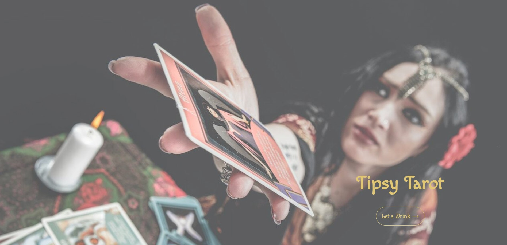
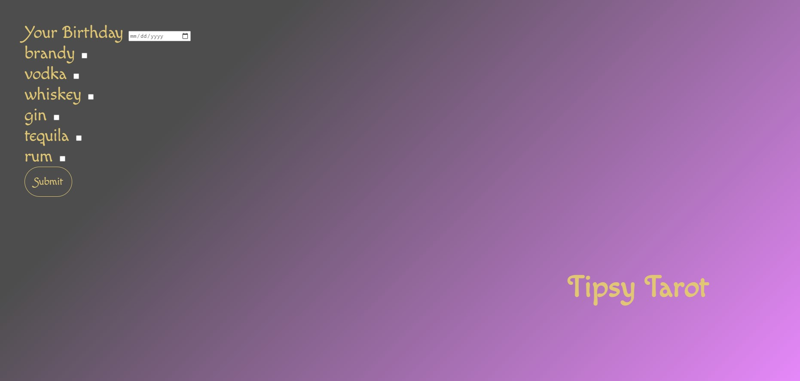
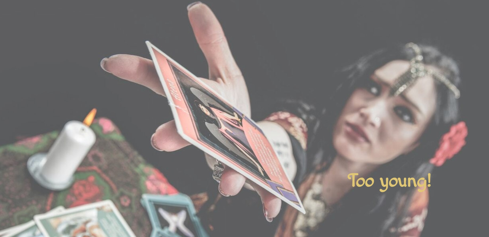
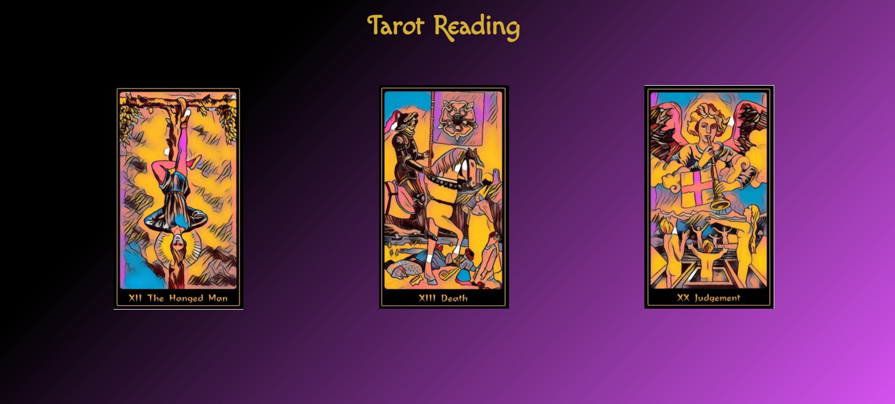
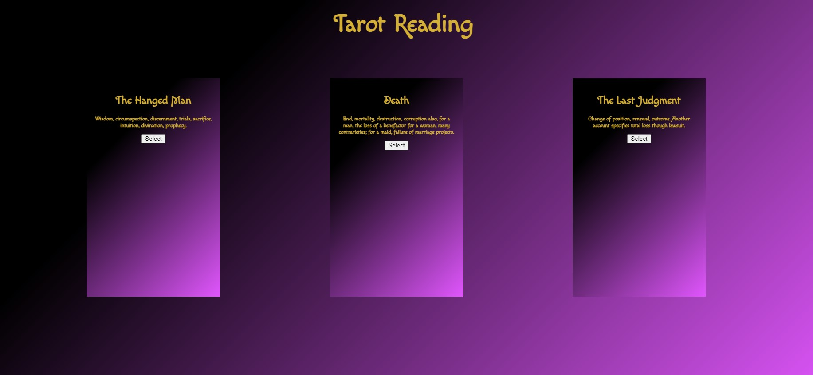
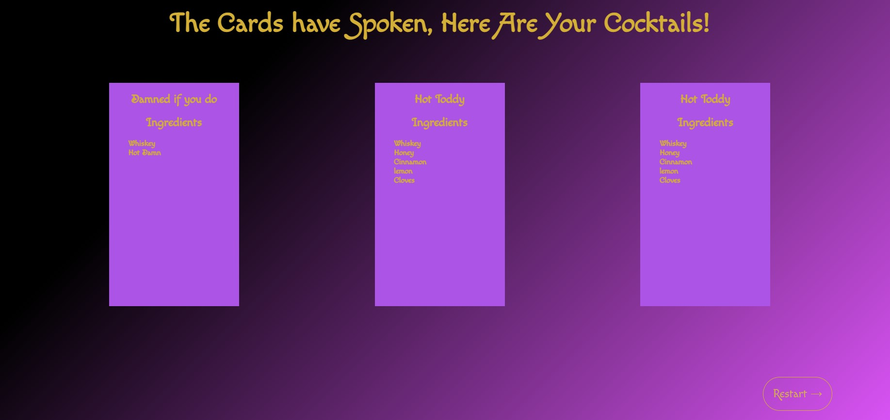

The Tipsy Tarot

-------------

This application uses dynamic css and html powered by javascript- while pulling from frameworks such as Bootstrap and Bulma to make the app responsive and modular- provides a unique experience for the social drinker:

Once legal drinking age of the user has been confirmed, **The Tipsy Tarot** generates both a randomized Tarot Reading and Cocktail Recipe for the user based on their inputed criteria utilizing two supporting application programming interfaces. 

-------------

Image here 

Pick your poison! 

(Ask Rachel to explain the booze array and how it selects cards and recipes so you don't sound like an idiot)

*Behold your future!*

Gif here to demo app 

*And depending on how your reading goes- play again!*

Cheers!

::crowd goes wild::

! Team Project URL

! Github URL

###### copyright (c) [2021] [Columbia School of Engineering]

###### Permission is hereby granted, free of charge, to any person obtaining a copy of this software and associated documentation files (the "Software"), to deal in the Software without restriction, including without limitation the rights to use, copy, modify, merge, publish, distribute, sublicense, and/or sell copies of the Software, and to permit persons to whom the Software is furnished to do so, subject to the following conditions:

###### The above copyright notice and this permission notice shall be included in all copies or substantial portions of the Software.

###### THE SOFTWARE IS PROVIDED "AS IS", WITHOUT WARRANTY OF ANY KIND, EXPRESS OR IMPLIED, INCLUDING BUT NOT LIMITED TO THE WARRANTIES OF MERCHANTABILITY, FITNESS FOR A PARTICULAR PURPOSE AND NONINFRINGEMENT. IN NO EVENT SHALL THE AUTHORS OR COPYRIGHT HOLDERS BE LIABLE FOR ANY CLAIM, DAMAGES OR OTHER LIABILITY, WHETHER IN AN ACTION OF CONTRACT, TORT OR OTHERWISE, ARISING FROM, OUT OF OR IN CONNECTION WITH THE SOFTWARE OR THE USE OR OTHER DEALINGS IN THE SOFTWARE.

